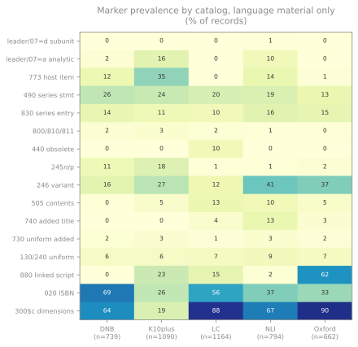

# Part-whole markers

The set work needs one question answered: when a record describes part
of something larger, how does it say so? This chapter measures eighteen
candidate markers across the five catalogs, across the six kinds of
material with at least 80 records, and across five publication eras.

## The material-type confound comes first

Measured across all 5,252 records, the markers vary widely. Measured
within a kind of material, most of that variation disappears. Prevalence by
leader/06:

| Marker | language | mixed | musical sound | notated music | 2-D image | manuscript |
|---|---|---|---|---|---|---|
| n | 4,449 | 292 | 199 | 103 | 82 | 26 |
| leader/07=d subunit | **0%** | **95%** | 0% | 0% | **93%** | 27% |
| 773 host item | 13% | **97%** | 40% | 20% | **100%** | 8% |
| 490 series statement | 21% | 0% | 8% | 21% | 0% | 0% |
| 830 series entry | 13% | 0% | 6% | 15% | 0% | 0% |
| 245 `$n`/`$p` | 7% | 7% | **41%** | 7% | 0% | 15% |
| 505 contents | 7% | 0% | **32%** | 21% | 0% | 0% |
| 130/240 uniform title | 7% | 0% | 2% | **22%** | 0% | 4% |
| 880 linked script | 19% | 0% | 1% | 1% | 0% | 8% |
| 020 ISBN | 44% | 0% | 1% | 12% | 0% | 0% |

Two mechanisms are visible, and they do not overlap:

- **Archival and image material** uses subunit records and host-item
  links. Mixed material is 95% `leader/07=d` and 97% `773`; 2-D image
  material is 93% and 100%. Neither carries `490` or `830` at all.
- **Books** use series statements. Language material is 21% `490` and
  13% `830`, and under 1% `leader/07=d`.

Sound recordings sit apart again: `245$n`/`$p` at 41% and `505` at 32%,
both far above books. That is consistent with a recording being
described as a numbered part with an enumerated contents note, though
these are nearly all NLI sound-archive records, so the pattern may
belong to that collection rather than to the material.

MARC defines `leader/07=d` for a part of a collection described
collectively elsewhere,[^l07d] and the corpus shows it used exactly
that way.
The confound is severe enough to invert a conclusion drawn without it:
measured across all material, `leader/07=d` looks like a heavy NLI
practice at 25% of NLI records. Restricted to books it falls to 4
records out of 794 at NLI and none at all in the other four catalogs.
The NLI subunit records are archival items reached by a language-based
query, not volumes of book sets. Every table below is
therefore restricted to language material.

## Leader/19 in this corpus

The [set survey](sets.md) is where the multipart resource record level
is examined across catalogs. Two things about it can only be measured
here, on the corpus, because they need many records rather than many
works.

**The two accompanying fields identify it exactly.** Treating "`773`
present **and** `245 $n` or `$p` present" as a test for a coded
dependent part, scored against leader/19 in the two catalogs that
populate it:

| | |
|---|---|
| True positives | 272 |
| False positives | **0** |
| False negatives | 1 |
| Precision | **1.000** |
| Recall | **0.996** |

Neither field does this alone. `773` by itself has precision 0.581,
because it equally marks an article inside a host. `245 $n`/`$p` alone
reaches 0.996, and the pair removes its one false positive.

The rule was read from and scored against the same 1,829 records, so
1.000 describes this corpus rather than predicting the next one. And
because the fields are written together by one family of export
software, this measures that output's internal consistency as much as
anything a cataloger decided.

**The clustering does not recover it, and that is not a contradiction.**

| What was scored | AMI with leader/19 |
|---|---|
| Corpus-wide partitions, all 5,252 records | 0.043–0.089 |
| Corpus-wide partitions, restricted to K10plus and DNB | **0.000** |
| Fresh partitions of K10plus and DNB together | 0.033–0.100 |
| Fresh partitions of K10plus alone | 0.204–0.248 |

All 287 coded dependent-part records fall inside the single largest
cluster, at every cut and under both feature sets. A dependent-part
record differs from an ordinary book on two features out of 442 and
matches it on everything else, which does not move a Jaccard
partition.[^twofeat] Monographic component parts differ on many
features, which is why a K10plus-only clustering scores 0.558 on
bibliographic level and 0.204 on multipart level at the same cut.

A two-field rule can be exact while the same two features fail to
organise a corpus. [Reading the numbers](reading-the-numbers.md)
returns to this, because it is the study's sharpest illustration of
what adjusted mutual information does and does not measure.

## Books only: prevalence by catalog

4,449 records: DNB 739, K10plus 1,090, LC 1,164, NLI 794, Oxford 662.
Percentages with 95% Wilson intervals; V is Cramér's V for the
association between the marker and the catalog.

| Marker | DNB | K10plus | LC | NLI | Oxford | V |
|---|---|---|---|---|---|---|
| leader/07=d subunit | 0% | 0% | 0% | 1% | 0% | 0.06 |
| leader/07=a component part | 2% | 16% | 0% | 10% | 0% | 0.28 |
| 773 host item | 12% | 35% | 0% | 14% | 1% | 0.40 |
| 490 series statement | 26% | 24% | 20% | 19% | 13% | **0.10** |
| 830 series entry | 14% | 11% | 10% | 16% | 15% | **0.08** |
| 490 ind1=1 traced | 16% | 14% | 10% | 16% | 13% | **0.07** |
| 130/240 uniform title | 6% | 6% | 7% | 9% | 7% | **0.04** |
| 800/810/811 name-title | 2% | 3% | 2% | 1% | 0% | 0.08 |
| 730 uniform added | 2% | 3% | 1% | 3% | 2% | 0.06 |
| 440 obsolete series | 0% | 0% | 10% | 0% | 0% | 0.28 |
| 245 `$n`/`$p` | 11% | 18% | 1% | 1% | 2% | 0.29 |
| 505 contents | 0% | 5% | 13% | 10% | 5% | 0.17 |
| 740 added title | 0% | 0% | 4% | 13% | 3% | 0.25 |
| 246 variant title | 16% | 27% | 12% | 41% | 37% | 0.26 |
| 880 linked script | 0% | 23% | 15% | 2% | 62% | 0.51 |
| 300 `$c` dimensions | 64% | 19% | 88% | 67% | 90% | 0.57 |
| 020 ISBN | 69% | 26% | 56% | 37% | 33% | 0.32 |

### The markers that travel

Three markers have a catalog effect small enough to rely on. `830`
(10-16%, V=0.08), traced `490` (10-16%, V=0.07), and `130`/`240`
uniform title (6-9%, V=0.04) vary by a few points across five
institutions. The uniform-title row is
the only one in the table where the chi-square test does not reject
independence (p=0.15). That is a failure to detect a difference, not a
demonstration that none exists.

`490` itself, at 13–26% and V=0.10, is the most widely used part-whole
marker and among the most consistent. It is also the weakest evidence:
a transcribed series statement asserts that words appeared on a piece,
not that a set exists.

### The markers that do not travel

`773` runs from none at all at LC (0 of 1,164) and 6 records at Oxford
to 35% at K10plus. `245$n`/`$p` runs from 1% at LC and NLI to 18% at
K10plus, where it accompanies a coded dependent part. `440` is 10% at LC and
0% everywhere else. It was made obsolete in 2008 and only LC's
unconverted legacy records carry it here; the German catalogs never
emitted it, since their MARC output postdates the change, so their zero
is format history rather than a cataloging choice.[^f440]

`740` is 13% at NLI and
essentially absent at DNB and K10plus.

`880` is the sharpest division among the part-whole and script markers
(V=0.51), and it is not about sets at all: 62% at Oxford, 23% at
K10plus, 15% at LC, 2% at NLI, and 2 records out of 739 at DNB. Oxford
romanizes into the main fields and links the Hebrew in `880`. NLI
catalogs in Hebrew directly and has nothing to link. The same book has
its Hebrew title in a different MARC field depending on which catalog
answered.

`300$c` is sharper still (V=0.57), and is house style: K10plus
records dimensions on 19% of books where LC and Oxford record them on
88% and 90%.

`800`/`810`/`811`, the traced name-title series added entry, is at or
below 3% everywhere. Whatever otzar does about sets, this is not the
field the material uses.

## What this corpus cannot see

**Pattern 6. Prevalence measured over a whole catalog is a different
quantity from prevalence within multi-volume works, and this chapter
reports the first.**

The draw axes — language, subject heading, publisher, year — say
nothing about which fields a record carries, which is what makes the
sample usable for the questions above. They also say nothing about
whether a record describes a volume of a set. The draw did reach them —
273 records across DNB and K10plus code a dependent part — but few
identifiable ones from the three catalogs that do not code the
position, and none by design.

The [set survey](sets.md) asked the same catalogs for 22 multi-volume
works by name. Where the two disagree, they disagree in a measurable
direction:

| | This corpus | Targeted at 22 sets |
|---|---|---|
| K10plus, leader/19 coded | 265 of 1,090 books (24%) | 235 of 295 records (79%) |
| DNB, leader/19 coded | 101 of 739 books (14%) | 80 of 119 records (67%) |

Both are correct. The first is a base rate across a catalog's books,
most of which are not part of a set; the second is conditional on a
multi-volume work. A marker that is uncommon overall can be the normal
mechanism within the material that matters.

The consequence for reading this chapter: its figures describe *these
catalogs' holdings as sampled*, not their treatment of any particular
kind of material. The material-type table above is the same warning in
a different form.

Where a claim in this chapter is about sets specifically, the set
survey supersedes it.

## Change over publication era

Restricted to books, binned on the first `008` date.

| Marker | before 1940 | 1940-69 | 1970-89 | 1990-2004 | 2005-25 |
|---|---|---|---|---|---|
| n | 537 | 969 | 374 | 799 | 1,756 |
| 490 series statement | 10% | 15% | 17% | 19% | **29%** |
| 830 series entry | 7% | 7% | 12% | 13% | **17%** |
| 773 host item | 14% | 11% | 26% | 12% | 12% |
| 440 obsolete series | 0% | 1% | **9%** | 6% | 1% |
| 505 contents | 3% | 4% | 3% | 4% | **13%** |
| 246 variant title | 19% | 17% | 14% | 24% | **34%** |
| 245 `$n`/`$p` | 9% | 8% | 8% | 6% | 5% |
| 740 added title | 5% | 6% | 10% | 5% | 1% |
| 880 linked script | 23% | 24% | 21% | 12% | 18% |
| 020 ISBN | 6% | 8% | 30% | 59% | **72%** |

Series statements rise steadily, and the rise is not sampling noise:
`490` moves from
10% (Wilson 8–13) to 29% (27–31), intervals nowhere near overlapping,
and `830` from 7% (5–10) to 17% (15–19).

`440` rises and falls: absent before 1940, 9% for material published
1970-89, back to 1% in the most recent bin. The field was made
obsolete in 2008, though the caveat below applies — this axis is the
era of the book, not of the record.

`020` reproduces the ISBN adoption curve, 6% to 72%, which is the
closest thing here to a check that the era axis measures something
real. The 6% on imprints published before 1940 is a reminder of that
axis's limit rather than a contradiction: ISBNs did not exist before
1967,[^isbn] and those rows are reprints, facsimiles and records whose
`008` date refers to an original the item reproduces.

One apparent trend is absent. `773` does not decline; it is flat
except for a bump in the 1970-89 bin. Pooled across all material it
looks like a steep fall, and that is an artifact of the changing
material mix across bins. `880` moves within a narrow band in both
views and shows no trend either way.

The per-catalog view shows the rise is not shared evenly. K10plus
carries `490` on roughly a quarter of books from 1940 onward. DNB
climbs from 3% before 1940 to 33% in the most recent bin, and LC from
9% to 36%. Oxford falls to nothing in the middle bins before reaching
28%.

One caveat governs this whole section. The `008` date is when the
*book* was published, not when the *record* was made. A 1905 imprint
catalogued in 1998 under then-current rules appears in the first bin.
The era axis therefore mixes a genuine change in cataloging convention
with the era of the material, and cannot separate them.

[^l07d]: **Not verified here.** The MARC definition of `leader/07=d` as
    a part of a collection described collectively elsewhere comes from
    format documentation. Confirming it means reading the MARC 21
    Bibliographic leader specification.

[^f440]: **Not verified here, and partly inference.** That `440` was
    made obsolete in 2008 comes from MARC 21 change documentation. That
    the German catalogs' zero reflects their MARC output postdating the
    change, rather than a cataloging decision, is a reading of the
    zero: the corpus shows only the absence. Confirming it means
    checking when each agency began emitting MARC 21 and whether their
    conversion maps a series statement onto `440` at all.

[^isbn]: **Not verified here.** That the ISBN was introduced in 1967
    is external to this study. The claim that the pre-1940 rows are
    reprints and facsimiles is an inference from the date mismatch, not
    a count of those records.

[^twofeat]: **Inference.** The feature counts and the AMI figures are
    computed. That the small feature difference is *why* the partitions
    do not isolate these records is an explanation consistent with
    them, supported by the contrast with monographic component parts,
    which differ on many features and do separate. Testing it directly
    would mean re-clustering with those two features upweighted and
    seeing whether the records then separate.
