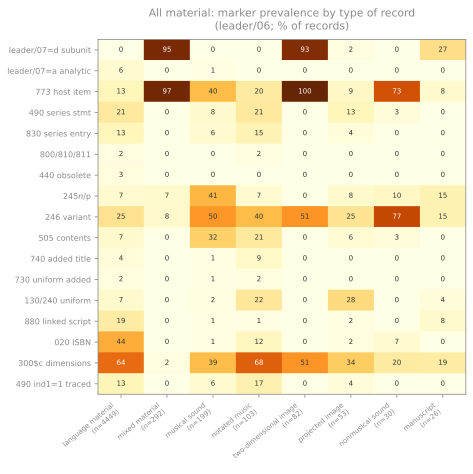
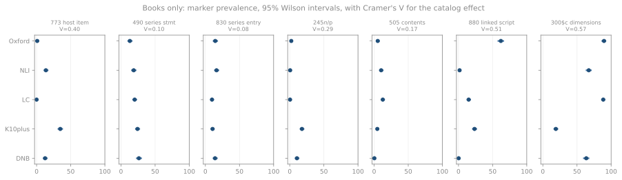
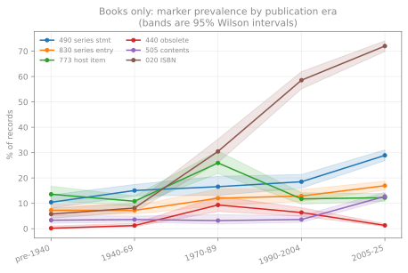
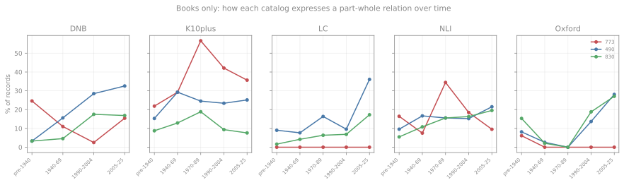

# Part-whole markers

The set work needs one question answered: when a record describes part
of something larger, how does it say so? This chapter measures every
plausible marker across the five catalogs, across eight kinds of
material, and across five publication eras.

## The material-type confound comes first

Measured across all 5,252 records, the markers look dramatic. Measured
within a kind of material, most of that drama disappears. Prevalence by
leader/06:

| Marker | language | mixed | musical sound | notated music | 2-D image | manuscript |
|---|---|---|---|---|---|---|
| n | 4,449 | 292 | 199 | 103 | 82 | 26 |
| leader/07=d subunit | **0%** | **95%** | 0% | 0% | **93%** | 27% |
| 773 host item | 13% | **97%** | 40% | 20% | **100%** | 8% |
| 490 series statement | 21% | 0% | 8% | 21% | 0% | 0% |
| 830 series entry | 13% | 0% | 6% | 15% | 0% | 0% |
| 245 `$n`/`$p` | 7% | 7% | **41%** | 7% | 0% | 15% |
| 505 contents | 7% | 0% | **32%** | 21% | 0% | 0% |
| 130/240 uniform title | 7% | 0% | 2% | **22%** | 0% | 4% |
| 880 linked script | 19% | 0% | 1% | 1% | 0% | 8% |
| 020 ISBN | 44% | 0% | 1% | 12% | 0% | 0% |

Two mechanisms are visible, and they do not overlap:

- **Archival and image material** uses subunit records and host-item
  links. Mixed material is 95% `leader/07=d` and 97% `773`; 2-D image
  material is 93% and 100%. Neither carries `490` or `830` at all.
- **Books** use series statements. Language material is 21% `490` and
  13% `830`, and **0%** `leader/07=d`.

Sound recordings sit apart again: `245$n`/`$p` at 41% and `505` at 32%,
both far above books, because a recording is routinely described as a
numbered part with an enumerated contents note.

This confound is severe enough to invert a conclusion. Measured across
all material, `leader/07=d` looks like a heavy NLI practice — 25% of
NLI records. Restricted to books it falls to 4 records out of 794 at
NLI and none at all in the other four catalogs. The NLI subunit records are archival items reached by a
language-based query, not volumes of book sets. Every table below is
therefore restricted to language material.

## Books only: prevalence by catalog

4,449 records: DNB 739, K10plus 1,090, LC 1,164, NLI 794, Oxford 662.
Percentages with 95% Wilson intervals; V is Cramér's V for the
association between the marker and the catalog.

| Marker | DNB | K10plus | LC | NLI | Oxford | V |
|---|---|---|---|---|---|---|
| leader/07=d subunit | 0% | 0% | 0% | 1% | 0% | 0.06 |
| leader/07=a analytic | 2% | 16% | 0% | 10% | 0% | 0.28 |
| 773 host item | 12% | 35% | 0% | 14% | 1% | 0.40 |
| 490 series statement | 26% | 24% | 20% | 19% | 13% | **0.10** |
| 830 series entry | 14% | 11% | 10% | 16% | 15% | **0.08** |
| 490 ind1=1 traced | 16% | 14% | 10% | 16% | 13% | **0.07** |
| 130/240 uniform title | 6% | 6% | 7% | 9% | 7% | **0.04** |
| 800/810/811 name-title | 2% | 3% | 2% | 1% | 0% | 0.08 |
| 730 uniform added | 2% | 3% | 1% | 3% | 2% | 0.06 |
| 440 obsolete series | 0% | 0% | 10% | 0% | 0% | 0.28 |
| 245 `$n`/`$p` | 11% | 18% | 1% | 1% | 2% | 0.29 |
| 505 contents | 0% | 5% | 13% | 10% | 5% | 0.17 |
| 740 added title | 0% | 0% | 4% | 13% | 3% | 0.25 |
| 246 variant title | 16% | 27% | 12% | 41% | 37% | 0.26 |
| 880 linked script | 0% | 23% | 15% | 2% | 62% | 0.51 |
| 300 `$c` dimensions | 64% | 19% | 88% | 67% | 90% | 0.57 |
| 020 ISBN | 69% | 26% | 56% | 37% | 33% | 0.32 |

### The markers that travel

Four markers have a catalog effect small enough to rely on. `830`
(10-16%, V=0.08), traced `490` (10-16%, V=0.07), and `130`/`240`
uniform title (6-9%, V=0.04) vary by a few points across five
institutions. The uniform-title row is
the only one in the table where the chi-square test fails to reject
independence at all (p=0.15) — its prevalence is statistically
indistinguishable across the five catalogs.

`490` itself, at 13–26% and V=0.10, is the most widely used part-whole
marker and among the most consistent. It is also the weakest evidence:
a transcribed series statement asserts that words appeared on a piece,
not that a set exists.

### The markers that do not travel

`773` runs from none at all at LC (0 of 1,164) and 6 records at Oxford
to 35% at K10plus. `245$n`/`$p` runs from 1% at LC and NLI to 18% at
K10plus. `440` is 10% at LC and
0% everywhere else — it was made obsolete in 2008, and only LC's
retrospective file still carries it here. `740` is 13% at NLI and
essentially absent at DNB and K10plus.

`880` is the sharpest division in the study (V=0.51), and it is not
about sets at all: 62% at Oxford, 23% at K10plus, 15% at LC, 2% at NLI,
and 2 records out of 739 at DNB. Oxford romanizes into the main fields and links the Hebrew
in `880`. NLI catalogs in Hebrew directly and has nothing to link. The
same book has its Hebrew title in a different MARC field depending on
which catalog answered.

`300$c` is sharper still (V=0.57), and is pure house style: K10plus
records dimensions on 19% of books where LC and Oxford record them on
88% and 90%.

`800`/`810`/`811`, the traced name-title series added entry, is at or
below 3% everywhere. Whatever otzar does about sets, this is not the
field the material uses.

## Change over publication era

Restricted to books, binned on the first `008` date.

| Marker | before 1940 | 1940-69 | 1970-89 | 1990-2004 | 2005-25 |
|---|---|---|---|---|---|
| n | 537 | 969 | 374 | 799 | 1,756 |
| 490 series statement | 10% | 15% | 17% | 19% | **29%** |
| 830 series entry | 7% | 7% | 12% | 13% | **17%** |
| 773 host item | 14% | 11% | 26% | 12% | 12% |
| 440 obsolete series | 0% | 1% | **9%** | 6% | 1% |
| 505 contents | 3% | 4% | 3% | 4% | **13%** |
| 246 variant title | 19% | 17% | 14% | 24% | **34%** |
| 245 `$n`/`$p` | 9% | 8% | 8% | 6% | 5% |
| 740 added title | 5% | 6% | 10% | 5% | 1% |
| 880 linked script | 23% | 24% | 21% | 12% | 18% |
| 020 ISBN | 6% | 8% | 30% | 59% | **72%** |

Series statements rise steadily and the rise is real: `490` moves from
10% (Wilson 8–13) to 29% (27–31), intervals nowhere near overlapping,
and `830` from 7% (5–10) to 17% (15–19).

`440` traces its own life cycle — absent before 1940, 9% for material
published 1970-89, back to 1% for the most recent bin, which is what
the obsoleting of the field in 2008 looks like from the far side.

`020` reproduces the ISBN adoption curve, 6% to 72%, and is the
cleanest validation available that the era axis is measuring something
real.

Two apparent trends are absent. `773` does not decline; it is flat
except for a bump in the 1970-89 bin. `880` does not rise. Both of
those look like strong trends when all material is pooled, and both are
artifacts of the changing material mix across bins.

The per-catalog view shows the rise in series statements is not shared
evenly: K10plus and DNB carry `490` on roughly a quarter of books
throughout, while LC and Oxford climb toward that level only in the
most recent bins.

One caveat governs this whole section. The `008` date is when the
*book* was published, not when the *record* was made. A 1905 imprint
catalogued in 1998 under then-current rules appears in the first bin.
The era axis therefore mixes a genuine change in cataloging convention
with the era of the material, and cannot separate them.
