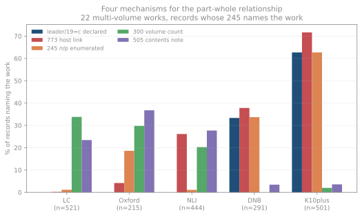
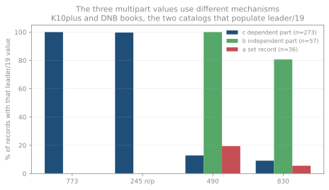
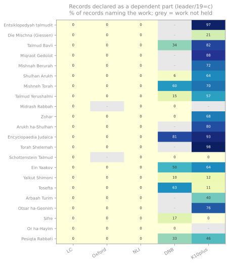

# How catalogs describe a set

**Pattern 1. Two of the five catalogs create hierarchical descriptions —
a record for the set and linked records for its volumes. The other three
never do, and the difference is documented policy rather than
idiosyncrasy.**

A multipart resource can be described at three levels. A
**comprehensive description** covers the whole in one record. An
**analytical description** covers a part in its own record, standing
alone. A description covering both the whole and its parts, with the
parts linked to the whole, is what AACR2 called **multilevel
description** and RDA calls **hierarchical description**. MARC encodes
the third in leader position 19, *multipart resource record level*: `a`
for the set record, `b` for a part with an independent title, `c` for a
part whose title depends on the set.

The Library of Congress rule interpretation on multilevel description
is a single sentence: *do not employ the technique of multilevel
description in any case*.[^lcri136] The successor guidance under RDA
continues not to create hierarchical descriptions.[^lcpcc] That is what
this chapter finds in the records, and the prohibition is old enough to
explain records catalogued long before RDA existed.

## The survey

Twenty-two multi-volume works a Torah-study collection is built from,
asked of all five catalogs — in Hebrew at NLI, romanized elsewhere,
since that is how each indexes.

Three filters, each of which moved the numbers:

- **Title.** A title query returns more than the work asked for, so each
  record's `245` is matched against the work, anchored at the start. An
  earlier pass counted 20 NLI records for *Sifre* of which none was the
  midrash: the Hebrew ספרי also begins ספרי ילדים, children's books.
- **Leader/07 `m`.** The responses carry archival subunits, journal
  articles and analytic entries. An earlier pass reported 116 NLI
  records linked with `773`, most of which were folios within a codex,
  sections of anthologies, and — through a loose pattern — song tracks
  on albums.
- **Publisher records.** Counted separately. Oxford's 36 apparent
  per-tractate records for *Die Mischna* are one vendor's e-book
  series: every one carries `300 $a "1 online resource"` and a `776` to
  the print edition. They are not Oxford's cataloging of a set.

What remains is 1,018 records that a library created, describing an
edition of the work asked for.

Sixty-six of the 110 catalog-work cells returned the fifty-record cap,
so those are records examined, not exhaustive counts. Query forms differ
per catalog, so the totals are not comparable holdings figures.

## What each catalog does

| Catalog | Records | leader/19 coded | `773` | `245 $n`/`$p` | Set-level extent | `505` | Vendor records set aside |
|---|---|---|---|---|---|---|---|
| LC | 321 | **0%** | 0% | 5 | **63%** | 24% | 1 |
| Oxford | 96 | **0%** | 7% | 2 | **59%** | 32% | 36 |
| NLI | 187 | **0%** | 10% | 4 | 24% | 32% | 0 |
| DNB | 119 | **67%** | 47% | 56 | 0% | 8% | 0 |
| K10plus | 295 | **79%** | 74% | 219 | 0% | 3% | 11 |

**Leader/19 is coded on 0 of 604 records at LC, Oxford and NLI** — not
rarely, never, across 22 works all three hold. At DNB and K10plus it is
coded on two records in three.

The mirror image is the extent statement. A set-level extent — `3 v.`,
`9 Bände`, or the open-ended `v. <1-27, 29-53>` — appears on 63% of LC
records and 59% of Oxford's, and on **one** record in 414 across the two
PICA catalogs.

Neither side is describing less. They are describing at different
levels, and the level is what the leader records.

## The three leader/19 values are three different records

Where a catalog codes leader/19, the value predicts the rest of the
record almost without exception.

| leader/19 | n | `773` | `245 $n`/`$p` | `490` | `830` |
|---|---|---|---|---|---|
| `c` part with dependent title | 273 | **100%** | **100%** | 13% | 9% |
| `b` part with independent title | 57 | 0% | 0% | **100%** | 81% |
| `a` set record | 36 | 0% | 0% | 19% | 6% |

A part whose title does not stand alone is linked to its set and
enumerated. A part with its own title is not linked at all — it is
described as a book that belongs to a series. The set record is the
thing pointed at.

That is the rule the cataloging manuals give, visible in the records:
separate records when a volume has a distinctive title, one record when
the parts are numbered without titles of their own.

## Work by work

Library records naming the work. Bold is records coding leader/19; `s`
marks records with a set-level extent.

| Work | LC | Oxford | NLI | DNB | K10plus |
|---|---|---|---|---|---|
| Entsiḳlopedyah talmudit | 2 (2s) | 2 (2s) | 12 (3s) | — | 30 (**30**) |
| Encyclopaedia Judaica | 9 (4s) | 7 (4s) | 4 | 44 (**41**) | 42 (**42**) |
| Torah Shelemah | 1 (1s) | — | 3 (1s) | — | 35 (**35**) |
| Talmud Bavli | 36 (20s) | 5 (3s) | 8 (7s) | 11 (**11**) | 19 (**18**) |
| Miqraot Gedolot | 28 (28s) | 12 (9s) | — | — | 14 (**14**) |
| Shulhan Arukh | 33 (20s) | 7 (1s) | 2 | 3 (**2**) | 15 (**14**) |
| Mishneh Torah | 22 (15s) | 10 (6s) | 2 (1s) | 3 (**2**) | 18 (**18**) |
| Yalkut Shimoni | 18 (6s) | 12 (7s) | 21 (6s) | 49 (**24**) | 37 (**9**) |
| Talmud Yerushalmi | 20 (13s) | 1 | 3 (3s) | — | 9 (**8**) |
| Otsar ha-Geonim | 5 (1s) | 4 (1s) | 9 (2s) | — | 17 (**15**) |
| Miḳraot / Mishnah Berurah | 17 (11s) | — | 18 (15s) | — | 3 (**2**) |
| Zohar | 31 (29s) | 17 (14s) | 4 | 3 | 5 (**1**) |
| Pesiqta Rabbati | 3 (3s) | 2 (2s) | 18 | — | 13 (**11**) |
| Arbaah Turim | 13 (8s) | 1 (1s) | 40 | — | 7 (**7**) |
| Arukh ha-Shulhan | 2 | 5 (4s) | 4 (3s) | — | 5 (**5**) |
| Die Mischna (Giessen) | 4 (1s) | 3 (1s) | 7 (3s) | — | 24 (**6**) |
| Sifre | 32 (17s) | 2 | — | 4 | 1 |
| Ein Yaakov | 13 (11s) | 2 (1s) | — | — | — |
| Tosefta | 15 (6s) | 1 | 2 | 1 | 1 |
| Or ha-Hayim | 12 (4s) | 3 (1s) | 18 (2s) | — | — |
| Schottenstein Talmud | 2 (1s) | — | 12 | 1 | — |
| Midrash Rabbah | 3 (2s) | — | — | — | — |

**Entsiḳlopedyah talmudit** is the clearest case. LC holds it as **two
records**, both with open-ended set-level extents — `v. <1-27, 29-53>`
for the Hebrew original and `v.` for the English translation — where
K10plus holds **thirty**, every one coded as a dependent part. Fifty-odd
volumes described once, against thirty volumes described thirty times.

**Encyclopaedia Judaica** runs the same way and is held by all five: 41
of 44 coded at DNB and 42 of 42 at K10plus, against 9 records at LC and
7 at Oxford, most with a volume count.

**The Schottenstein Talmud is the exception.** Held by four catalogs —
12 records at NLI, 2 at LC, 1 at DNB — and coded by none. The modern
English Talmud, the edition a contemporary collection is most likely to
hold, is the one nobody describes hierarchically.

## The pattern is older than RDA

RDA was implemented in 2013 and fewer than a third of the corpus
records declare it in `040 $e`, so a rule change cannot be what
produced this. Coding rates by the imprint's own date, across the
corpus rather than the survey:

| Imprint era | PICA books | coded | Anglo books | coded |
|---|---|---|---|---|
| before 1970 | 640 | 28% | 866 | **0** |
| 1970–89 | 124 | 31% | 250 | **0** |
| 1990–2004 | 371 | 13% | 428 | **0** |
| 2005–12 | 194 | 13% | 278 | **0** |
| 2013 onward | 498 | 14% | 786 | 1 |

Not one of 866 pre-1970 Anglo-American books codes the position, and
the PICA catalogs code throughout. The AACR2-era prohibition and its
RDA-era successor bracket the whole span.

The usual caveat on this axis applies: `008` gives the date of the
book, not of the record, so a 1930 imprint may have been catalogued in
2015. What the table shows is stability across the material, which is
weaker than stability across cataloging eras but points the same way.

## How good is this evidence

**Strong for the absence.** Zero across 604 records, 22 works and three
institutions, and it agrees with published LC-PCC policy. Two of those
three — Oxford and NLI — run the same Alma software, so they are not
three independent systems; but LC answers through an unrelated Z39.50
gateway, and records demonstrably move between these catalogs through
shared cataloging.[^shared]

**Weaker for the presence.** DNB and K10plus both run PICA, and
leader/19 is reportedly system-generated rather than keyed by a
cataloger.[^gen] Their agreement may be one observation of one export
routine rather than two institutions choosing the same thing.

**One thing this survey does not show.** LC's own rule interpretation
says LC analyzes and classes separately, creating a record for each
dependent-titled part with the comprehensive title as the common
title — which in MARC is `245 $a` plus `$n`/`$p`.[^lcri] Five such
records appear among LC's 321 here. Either this material falls under
the stated exceptions, or those records exist outside the fifty-record
responses this survey saw. It is unresolved, and it is the first thing
to check before relying on the comprehensive-description reading.

## What follows for otzar

**Read leader/19 when present.** It is the only place set membership is
stated rather than inferred, and it distinguishes a volume from an
article, which `773` alone does not.

**Expect a one-to-many mismatch across sources.** The same encyclopedia
is two records from LC and thirty from K10plus. Any identity rule
assuming one-to-one correspondence will be wrong on the material otzar
exists to catalogue.

**Parse the extent statement.** A set-level extent — including
open-ended forms like `v.` and `v. <1-27>` — is the Anglo-American
signal that a record describes a whole set, on 63% of LC records here.
An earlier version of this study missed 168 such records by requiring a
leading digit.

**Parse `505` for volume lists.** Where these catalogs describe a set
comprehensively they put the parts in a contents note: 78 records at LC,
61 at NLI, 31 at Oxford.

**Set publisher e-records aside before drawing conclusions.** They
imitate per-volume cataloging and are not it.

[^lcri136]: **Not verified here.** The rule interpretation was read
    through a vendor mirror rather than from the Library of Congress
    directly. Confirming it means reading LCRI 13.6 in Cataloger's
    Desktop or the free rule interpretation files LC publishes.

[^lcpcc]: **Not verified here.** That LC and PCC practice does not
    create hierarchical descriptions comes from the LC-PCC guidance
    reached through search. It is the explanation this chapter's
    central finding fits, which is a reason to check it carefully
    rather than to accept it.

[^shared]: **Inference.** Records moving between catalogs is
    established for one item in the [case chapter](cases.md), where LC
    and Oxford hold the same record, and by 41 NLI rows carrying
    `040 $aDLC`. How much of the agreement across the three is shared
    records rather than shared practice is not measured.

[^gen]: **Not verified here.** That leader/19 is usually system
    generated comes from vendor MARC documentation, not from the MARC
    21 specification or from the two catalogs. Confirming it means
    asking DNB and K10plus how their export populates the position.

[^lcri]: **Not verified here.** The rule interpretation on analysis of
    monographic series and multipart monographs was read through a
    vendor mirror rather than from LC directly, and the exception
    categories it names were not checked against this material.
