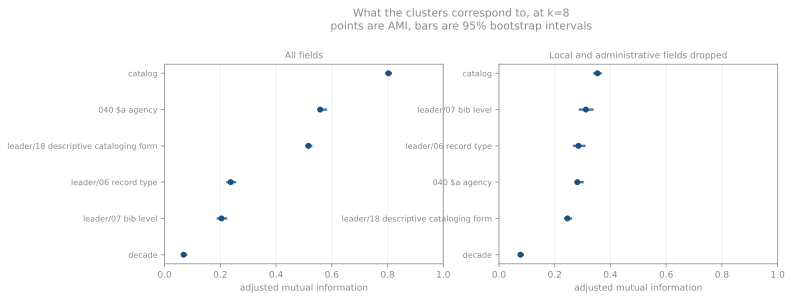

# Institutional signatures

**Pattern 2. House style is a property of the institution, and survives
holding the cataloging tradition constant.**

This is the pattern that disagrees with [pattern 1](sets.md). There,
three catalogs converge completely on how they treat a set. Here, the
same three separate from one another on general record structure at
AMI 0.394. Both hold: the part-whole mechanism travels with the
tradition, and everything else stays local.

## Every field included: the clusters are the catalogs

Clustering all 5,252 records on all 725 structural features recovers
which catalog answered before any other label.

| Cut | catalog | `040$a` | leader/18 | leader/06 | leader/07 | decade |
|---|---|---|---|---|---|---|
| k=4 | **0.655** | 0.403 | 0.286 | 0.190 | 0.139 | 0.042 |
| k=8 | **0.803** | 0.558 | 0.516 | 0.237 | 0.204 | 0.068 |
| k=12 | **0.788** | 0.552 | 0.519 | 0.235 | 0.237 | 0.073 |

Adjusted mutual information. At k=8 the interval on the catalog figure
is 0.795–0.812, and on the next-best label, `040$a`, 0.559–0.579
around a point estimate of 0.558. The two intervals are far apart, so
the separation is not sampling noise. The intervals themselves are
narrow and slightly optimistic: they resample records against a
partition computed once on the whole corpus, which shifts the
chance-adjustment upward and can leave a point estimate a thousandth
below its own lower bound, as `040$a` does here.

The features carrying that separation are administrative. NLI's
clusters are marked by `903`, `939`, `919`, `964` and Alma's
non-numeric `AVE`; LC's by `906` with its `$b` through `$g`; DNB's by
`044` and `850`.[^overrep] These describe how a record was processed and where
it is held. The exception is `044`, a country-of-publication code DNB
sets on nearly every record; none of the others describes a book.

This is the third of the three possible outcomes, and it arrives
first and strongest.

## The fingerprint is institutional, not the software

NLI and Oxford run the same Alma software on separate installations,
exchange the same record format, and answer the same SRU version and
query syntax. If the signature above were an artifact of export
tooling, these two should be hard to tell apart. Clustering only those
2,109 records:

| Cut | best label | AMI |
|---|---|---|
| k=2 | `040$a` agency | 0.158 |
| k=4 | **catalog** | **0.790** |
| k=6 | catalog | 0.609 |

A cut of two Alma institutions separates them almost as sharply as a
cut of all five catalogs separates those (0.790 against 0.803).
Whatever produces the fingerprint is the practice of the institution,
not the shape its export software imposes. With the local and
administrative fields dropped the same pair separates at 0.32–0.39,
which is where the bibliographic signal takes over.

The [case studies](cases.md) show the mechanism directly: for one item
held by both, NLI and Oxford produce near-identical `245`, `264` and
`300`, and diverge entirely in the local block.

## Standard fields alone: no signal dominates

MARC reserves `09X`, `59X`, `69X` and `9XX` for local definition.
Dropping those, together with the administrative `0XX`, `85X` and
`88X` fields that name the agency, its record number, its holdings or
its provenance, leaves 442 features.

| Cut | catalog | leader/06 | leader/07 | `040$a` | leader/18 | decade |
|---|---|---|---|---|---|---|
| k=4 | 0.355 | 0.192 | 0.246 | 0.280 | 0.241 | 0.059 |
| k=8 | 0.353 | 0.285 | 0.312 | 0.281 | 0.246 | 0.077 |
| k=12 | 0.346 | 0.336 | 0.330 | 0.274 | 0.255 | 0.090 |

At k=12 the intervals are catalog 0.334–0.358, leader/06 0.319–0.358,
leader/07 0.311–0.352. All three overlap. Bibliographic structure is
present and strengthens as the cut gets finer, but it never separates
from the institutional signal, and no organising principle wins.

That is the second possible outcome sitting alongside the third: the
treatments are real enough to show up, and not sharp enough to sort
records by.

The [marker chapter](markers.md) shows the same taxonomy declared
explicitly in leader/19 at K10plus and DNB, and expressed there almost
without exception by two fields that are in this vector, `773` and
`245 $n`/`$p`. The clustering does not organise on them. Scored against
these partitions and restricted to those two catalogs, adjusted mutual
information with leader/19 is 0.000: all 287 dependent-part records fall
inside the largest cluster, at every cut and under both feature sets.
Fresh partitions of the two catalogs together reach 0.03-0.10, and of
K10plus alone 0.20-0.25.

That is not a contradiction. A dependent-part record differs from an
ordinary book on two features out of 442 and matches it on the rest,
which does not move a Jaccard partition.[^twofeat2] Monographic component parts
differ on many features, which is why a K10plus-only clustering scores
0.558 on bibliographic level and 0.204 on multipart level at the same
cut. Both results stand: exact where declared, and not an axis these
records sort on.

## Within one catalog, the answer changes

Clustering inside a single catalog holds the institution constant.
The result is not consistent across catalogs.

| Catalog | Cut | Strongest label | AMI | leader/07 at that cut |
|---|---|---|---|---|
| K10plus | k=4 | leader/07 bibliographic level | 0.558 | 0.558 |
| NLI | k=8 | leader/07 bibliographic level | 0.548 | 0.548 |
| LC | k=4 | leader/06 record type | 0.770 | -0.003 |
| Oxford | k=4 | leader/18 descriptive cataloging form | 0.587 | 0.043 |
| DNB | k=8 | `040$a` code | 0.268 | 0.106 |

The cut differs by row: each reports the better of k=4 and k=8 for that
catalog, which inflates every figure in the table. At a single k=4 the
NLI figure is 0.358; at k=8 the K10plus figure is 0.353.

At K10plus and NLI a record's structure predicts its declared
bibliographic level — though at NLI much of that signal is the 359
archival subunit records standing against books, the same material-type
confound the marker chapter dismantles. At Oxford the same structure
predicts the descriptive cataloging form, which separates AACR2-era
from ISBD-punctuated records, and says nothing about bibliographic
level. At LC it predicts the type of material, and does so through a
1161/20/2/2 split that isolates the 24 non-language records rather than
finding structure among books. At DNB it predicts very little; those
records are structurally uniform, and the best available label is the
`040$a` code, which at DNB identifies an internal cataloging unit.

The LC and Oxford figures for leader/07 are near zero in part because
neither sample varies much on it. That is itself the finding: the
distinctions the taxonomy names are not distinctions those catalogs
draw in this material.

## The partitions are stable

Every cluster large enough to test recovers under resampling. Across 30
resamples at 80% of the corpus, mean best Jaccard recovery:

| Feature set | Cluster sizes | Recovery |
|---|---|---|
| All fields | 1959, 1249, 791, 621, 564, 43, 18 | 0.94–1.00 |
| Standard only | 3778, 554, 499, 297, 84, 24, 13 | 0.92–1.00 |

Both rows are the k=8 partition, the only cut at which stability was
measured.

The k=8 partitions are reproducible under subsampling. A recovery
below about 0.5 would mean a partition dissolves on a resample; none
of these come close to that. This says nothing about the choice of k
itself, which was made after seeing the results.

The caveat is what stability does *not* establish. A partition can be
perfectly reproducible and still correspond to nothing of interest —
which is exactly the case for the all-fields clustering, whose stable
clusters are stable because accession-number formats are consistent
within an institution.

[^overrep]: **Not reproducible from the published data.** These field
    names come from the per-cluster over-representation output of the
    clustering run. That output is not among the published
    [data files](data.md), which carry tag presence but not the
    feature vector the clustering used. The AMI figures in this chapter
    are likewise not recomputable from the CSV. Confirming these names
    means re-running the clustering from the corpus.

[^twofeat2]: **Inference.** See the same footnote in the
    [marker chapter](markers.md). The counts and the AMI values are
    computed; that the feature difference is the cause is an
    explanation consistent with them rather than a tested one.

## The tradition is not the unit, except for sets

Grouping the five catalogs into two traditions — LC, Oxford and NLI
against DNB and K10plus — and scoring the partitions against that
label instead of against the catalog:

| Cut | catalog | tradition |
|---|---|---|
| k=8, all fields | **0.803** | 0.595 |
| k=8, standard only | **0.353** | 0.196 |
| k=12, standard only | **0.346** | 0.188 |

The catalog wins at every cut. Clustering *within* one tradition, where
a pure two-tradition account predicts its members should be
indistinguishable:

| Subset | Catalogs | Records | AMI with catalog, k=8 |
|---|---|---|---|
| LC, Oxford, NLI | 3 | 3,294 | 0.394 |
| DNB, K10plus | 2 | 1,958 | 0.217 |

They stay distinguishable. So on general record structure the unit of
variation is the institution, and the [set survey](sets.md) finding
that three of them behave identically is specific to the part-whole
mechanism rather than a general convergence.
